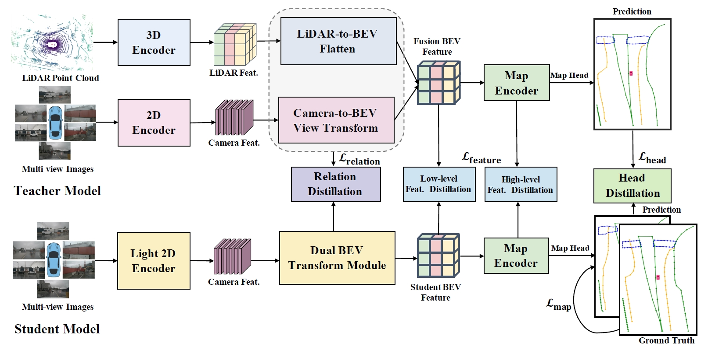

<h1>MapDistill </h1>
<h3>Boosting Efficient Camera-based HD Map Construction via Camera-LiDAR Fusion Model Distillation</h3>

ArXiv Preprint (coming soon)

#

## Table of Contents
  - [News](#news)
  - [TODO List](#todo-list)
  - [License](#license)
  - [Acknowledgements](#acknowledgements)
  - [Citation](#citation)

## News
* **`Jul. 1st, 2024`:** :fire: MapDistill is accepted to ECCV 2024. Code/Models are coming soon. Please stay tuned! :coffee:

## TODO List
- [x] Initial release. 🚀
- [ ] Getting Started.
- [ ] Installation.
- [ ] MapDistill checkpoints.
- [ ] MapDistill code.
- [ ] ...

## License
This work is under the [Apache License Version 2.0](https://www.apache.org/licenses/LICENSE-2.0), while some specific operations in this codebase might be with other licenses. Please refer to [LICENSE](LICENSE) for a more careful check, if you are using our code for commercial matters.

## Acknowledgements

MapDistill is based on [MapTR](https://github.com/hustvl/MapTR/tree/main) and [MapTRv2](https://github.com/hustvl/MapTR/tree/maptrv2). It is also greatly inspired by the following outstanding contributions to the open-source community: [mmdetection3d](https://github.com/open-mmlab/mmdetection3d), [BEVFormer](https://github.com/fundamentalvision/BEVFormer), [GKT](https://github.com/hustvl/GKT), [BEVDistill](https://github.com/zehuichen123/BEVDistill).

## Citation
If you find MapDistill is useful in your research or applications, please consider giving us a star 🌟 and citing it by the following BibTeX entry.
